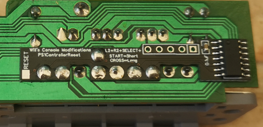
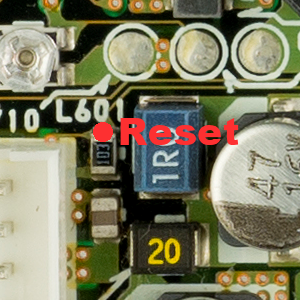
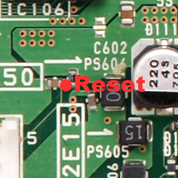
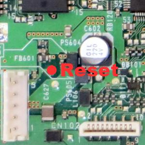
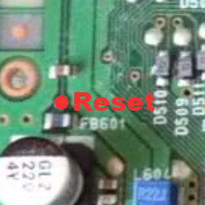
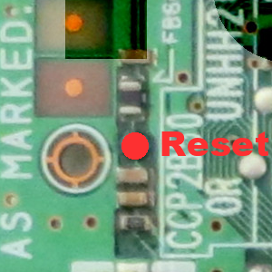

Place the In-Game-Reset board over the controller port pin holes and solder it in place.

Once done, solder a wire from the RESET point on the In-Game-Reset board to the Reset point on your motherboard, different motherboards have different Reset location points, see below using your motherboard version number as a guide.

**PU-8 Reset Point**  

**PU-18 Reset Point**  

**PU-20 Reset Point**  

**PU-22 Reset Point**  

**PU-23 Reset Point**  
